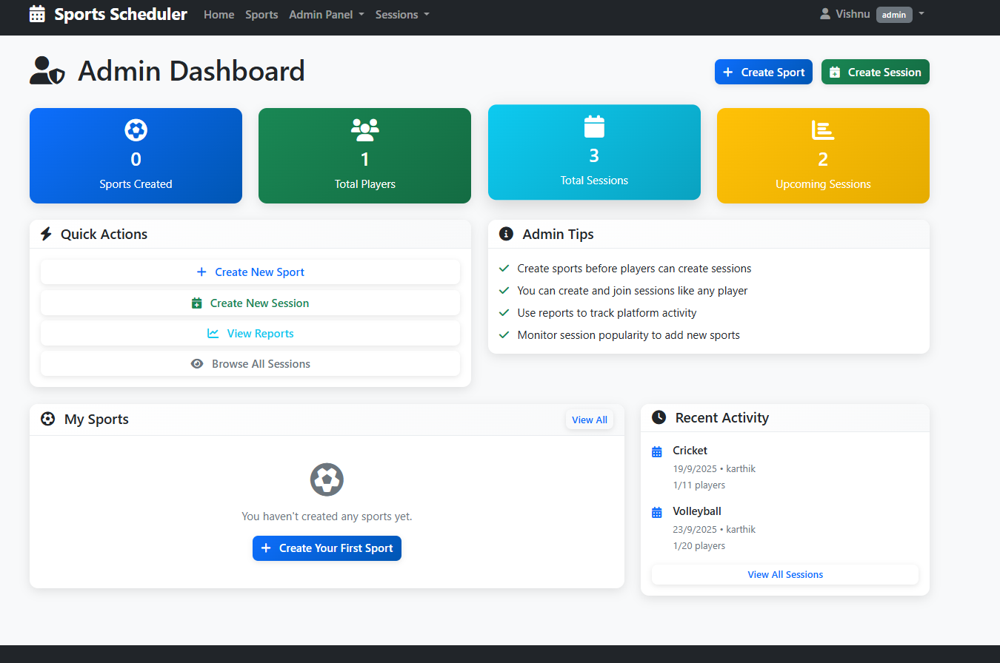

# Sports Scheduler

Sports Scheduler is a web application that helps players and administrators manage sports sessions easily. It is built using Node.js, Express.js, and Sequelize with PostgreSQL as the database.

## Features

- User authentication with login and signup
- Two roles: Admin and Player
- Admins can create, manage, and monitor sessions
- Players can browse available sessions, join or leave sessions
- Dashboard view for both players and admins
- Filter sessions by sports type
- Prevents joining past or full sessions

## Technology Stack

- Node.js
- Express.js
- PostgreSQL with Sequelize ORM
- EJS for templating
- CSS for styling
- Jest and Supertest for testing

## Screenshots
 
 

## Live Application

https://sports-scheduler-3hli.onrender.com

## Video

## Installation and Setup

1. Clone the repository:
[   git clone [https://github.com/your-username/sports-scheduler.git](https://github.com/VishnuvardhanKunche/Sports-Scheduler.git)
]   cd sports-scheduler

2. Install dependencies:
    npm install

3. Create a .env file and configure database credentials:
    DATABASE_URL=your_postgres_url
    SESSION_SECRET=your_secret

4. Run migrations:
    npx sequelize db:migrate

5. Start the server:
    npm start

6. Open the app in your browser:
    http://localhost:3000

7. Testing
    Run the test suite with:
    npm test
